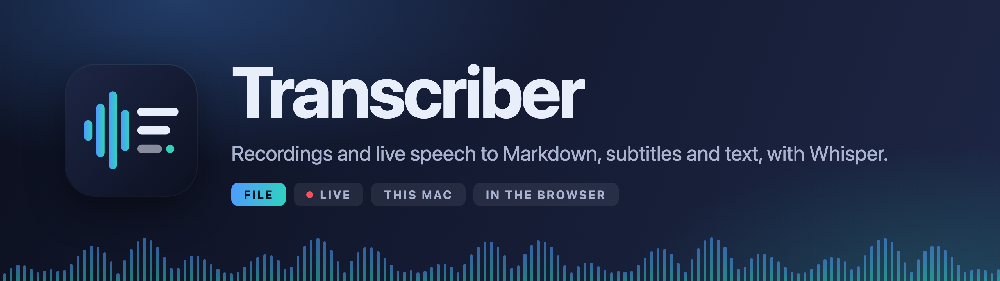
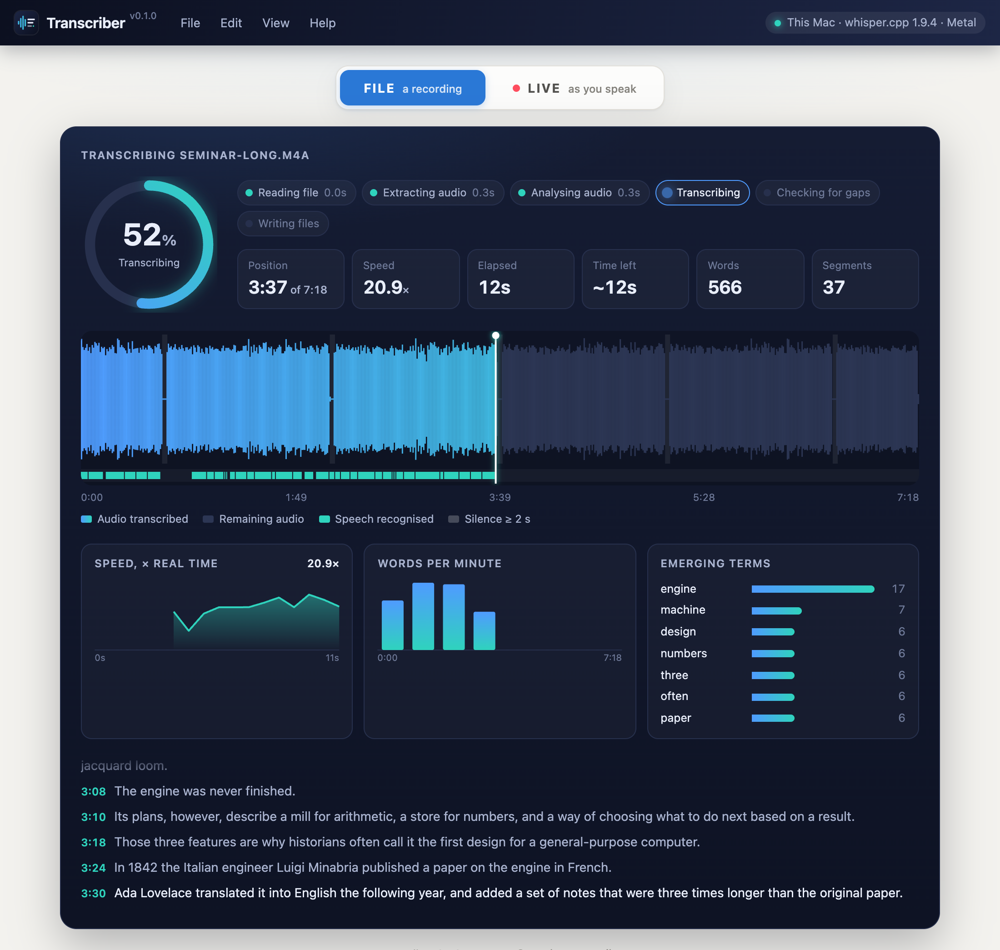
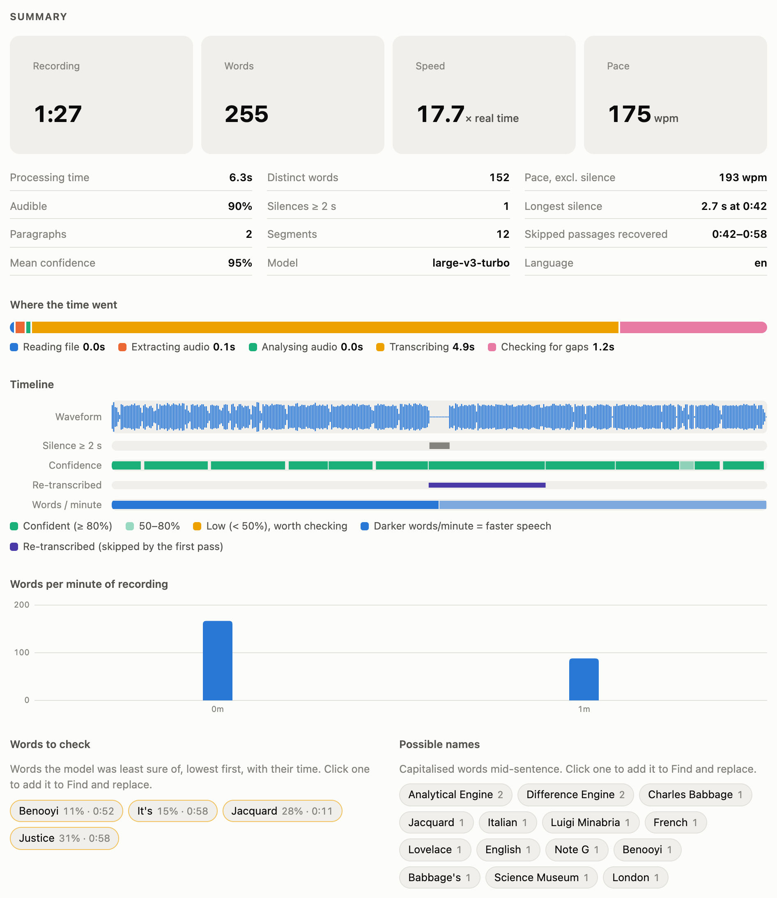
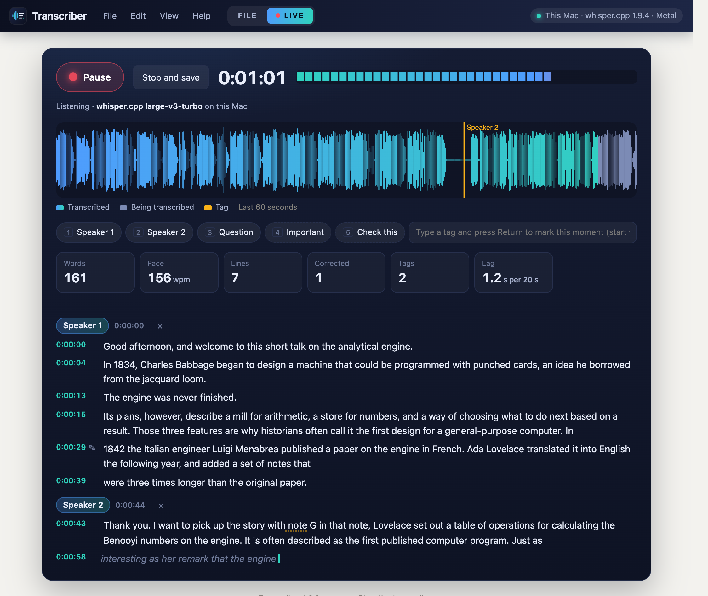

<p align="center"></p>

Transcriber turns recordings and live speech into Markdown, subtitles (.srt) and plain text with OpenAI's Whisper speech-recognition models. It runs in two places from one page:

- **On a Mac**, as a small local app using [whisper.cpp](https://github.com/ggml-org/whisper.cpp) with Metal: about 20× faster than real time with the large-v3-turbo model, and the files are saved beside the recording.
- **In the browser**, at **<https://critical-code-studies.github.io/transcriber/>**, using [transformers.js](https://github.com/huggingface/transformers.js) on WebGPU. Nothing is uploaded: the models are downloaded once and cached, the audio stays in the browser, and the files are downloaded at the end. The web version keeps nothing from a transcription after the page is closed or reloaded (no drafts, find/replace lists, tag or speaker names); it remembers only display preferences such as theme, model, language and volume. When the web page finds the Mac app running, it offers to switch to it.

<p align="center"></p>

## FILE mode

Drop a recording on the page (or **File › Open Recording…**, ⌘O). The title, output name, the names-and-terms prompt and the language are filled in from the file's tags (title, artist, date, URL, audio language) or from the filename, and transcription starts straight away unless *Start as soon as a file is chosen* is unticked.

While it runs, the progress panel shows each stage with its timing, a waveform that fills in as Whisper works through the audio, the recognised speech, silences, speed, time left, words per minute and the most frequent terms so far, with the text appearing line by line.

After the main pass, Transcriber compares the recognised text with the audio levels it has measured. Any stretch of 4 seconds or more with clear sound but no text, which Whisper sometimes skips after a pause, is transcribed again on its own and merged in, and the Markdown notes where this happened.

<p align="center"></p>

The summary gives totals (words, pace, audible share, silences), where the processing time went, and a timeline with lanes for the waveform, silences, per-segment confidence, speakers, re-transcribed passages and speaking rate. **Words to check** lists the words the model was least sure of, with their times. **Possible names** lists capitalised words mid-sentence. Clicking either adds the word to *Find and replace*.

The **Transcript** panel plays the recording: click a time, the waveform or a timeline lane to play from there, and the current line is highlighted as it plays. Lines can be corrected in place, speakers renamed or reassigned, and **Save corrections** rewrites the files without transcribing again. Playback starts at half volume, with a volume control and speeds from 0.75× to 2×.

Set the player to **Read aloud** to hear the transcript spoken by the browser's own voices, with a male or female voice. Each speaker can be given a different voice (Speaker 1 takes the chosen voice and Speaker 2 the other, unless set by hand), which helps when checking corrections and attributions by ear.

## LIVE mode

Press **Start recording** (⌘R) and allow the microphone. Text appears a few seconds behind speech. Grey italic text is provisional; it is committed at a pause, as whole sentences.

- Click any line to correct it while recording continues. Words the model was unsure of are underlined.
- Press **1–9** (outside a text field), click a tag, or type one and press Return to mark the current moment. When not recording, click a tag button to rename it (for example to a speaker's name); right-click it to switch between heading and marker, remove it, or add another. Tags become headings in the Markdown; a tag starting with `*` becomes an inline marker instead.
- **Stop and save** (⌘S) writes the .md, .srt and .txt and, if chosen, the audio as .wav. In the Mac app, committed lines and tags are also kept in the browser while recording, so a closed tab can be recovered as text; the web version does not keep them.

<p align="center"></p>

## Speakers

With *Speakers* set to *Detect automatically* (or a fixed number), each segment's voice is compared using [WeSpeaker](https://github.com/wenet-e2e/wespeaker) ResNet34 embeddings (a 27 MB model, downloaded once, run in the page for both engines). Segments are grouped by voice, and the files mark each change of speaker, which also starts a new paragraph:

```
**[0:00:42]** [Speaker 2] Thank you. I want to pick up the story with Note G…
```

In LIVE mode each new line is matched against the voices heard so far, and the whole session is regrouped when recording stops; regrouping keeps each speaker's number and name on the voice it had. Speakers can be renamed in the Transcript panel. Click or right-click a line's speaker chip (or right-click the line) to set its speaker, start a new one, or move every line of that speaker to another, which merges two speakers that are really one. Attributions are automatic and should be checked.

## Output

Files are written to the output folder (default: the recording's folder) and never overwrite existing ones: `name.md`, `name.srt`, `name.txt`, and `name.wav` for live sessions.

The Markdown has a title; a source line with the duration and any file metadata (creator, date, URL); a method note (model, language, date, whether a prompt, corrections, speaker identification or re-transcription were used); section headings or tags; and paragraphs that start at a change of speaker, after a silence of 2 seconds or more, or at the first sentence end after about 75 seconds. Each paragraph begins with a bold timestamp such as `**[0:04:07]**`.

*Section headings* (FILE mode) take one `time heading` per line, such as `12:30 First speaker`; each heading goes before the sentence starting nearest that time. *Find and replace* takes one `wrong => right` per line and matches whole words, case-sensitively.

## Menus and shortcuts

The page holds one project at a time: a recording or a live session. Switching between FILE and LIVE with something open asks first, and **File › New Project** (⌥⌘N) clears the page; files already written are kept.

**File** (New Project ⌥⌘N, open, transcribe, live recording, open or download the files), **Edit** (copy the transcript, apply corrections, clear fields), **View** (FILE or LIVE ⌘1/⌘2, appearance, technical log, switch engine) and **Help** (how to use it, shortcuts, source, About). Space plays and pauses the recording when you are not typing.

## Installing the Mac app

Requirements (Homebrew):

```bash
brew install ffmpeg whisper-cpp
```

Models, in `~/Documents/whisper-models/`:

```bash
mkdir -p ~/Documents/whisper-models && cd ~/Documents/whisper-models
curl -LO https://huggingface.co/ggerganov/whisper.cpp/resolve/main/ggml-large-v3-turbo.bin
curl -LO https://huggingface.co/ggerganov/whisper.cpp/resolve/main/ggml-base.bin
```

Then clone this repository and build the launcher:

```bash
git clone https://github.com/critical-code-studies/transcriber.git ~/Projects/transcriber
~/Projects/transcriber/make-app.sh
```

Double-click **Transcriber** in `~/Applications`. It starts a server on `http://127.0.0.1:8765/` (standard-library Python, no packages) and opens the page. The server stops after 15 minutes with no page open and nothing running, or from **File › Stop Transcriber**. Logs go to `~/Library/Logs/Transcriber.log`.

The server listens on 127.0.0.1 only. It refuses requests with a foreign `Host` header and write requests without its own header. The GitHub Pages copy may read `/api/about` to detect the app (CORS for that origin only), and nothing else.

## Files

| File | Role |
|---|---|
| `index.html`, `app.js` | the page, shared by both engines |
| `format.js` | Markdown, SRT, statistics and autofill for the browser engine (mirrors `transcriber.py`) |
| `worker.js` | Whisper and WeSpeaker in a browser worker |
| `transcriber.py` | local server: ffmpeg, whisper-cli, whisper-server for LIVE mode, file output |
| `launch.sh`, `make-app.sh` | start the server and open the page; build the `.app` |
| `branding/` | mark, app icon, banner, screenshots and the headless-Chrome renderer used to make them |

## Credits

Created by David M. Berry. © 2026 David M. Berry.

Whisper models by OpenAI. whisper.cpp by Georgi Gerganov and contributors. transformers.js and the ONNX model conversions by Hugging Face. WeSpeaker by the WeNet community. FFmpeg by the FFmpeg developers.
